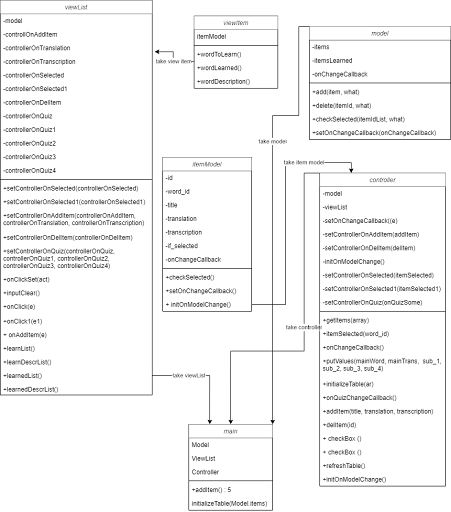

## Functional Web-application of the word learning app "Faraway" using the MVC template

## General info about the foreign word learning app "Faraway"

The web application consists of six pages: user registration, login, the home page, user profile, application, and application page.

After logging in, the user is redirected to the profile page. In the main menu, you should go to the application directly through the link "APP". 

The application allows you to add new words to the dictionary. To do this, be sure to fill out the forms "Word", "Translation" and "Transcription" if desired. After that, in the dictionary "To learn" you can view all possible elements. Clicking on the selected word at the bottom will open a window with word translation and transcription. 

It is possible to consolidate the learned words. To do this, if you add new words to the dictionary, you need to click on the "Refresh" button, which will update the information in the system. Then select one of the options and click "Check" and then a message will appear about the success or failure. If the choice is correct, this word will be added to the dictionary of learned words and will be removed from the dictionary of new words. You can view their content by clicking the mouse.

## Tools and Technologies Used

* HTML5
* CSS3
* Framework Twitter Bootstrap
* Javascript
* Visual Studio Code

## Setup

1. Download and Clone this project
2. Open the project with Visual Studio Code.
3. Start the Live Server.
4. Check out the functionality of the Word Learning App in the newly created tab of your browser.

## Class diagram of Javascript functionality

